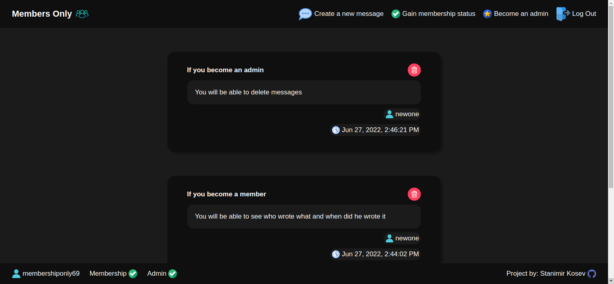

# odin-members-only

The Odin Project Curriculum - Full Stack JavaScript Path - NodeJS Section - Project Nº24

Goal: Create an app where a user can create an account, become a member and admin and have different abilities and permissions.

[Demo Link](https://gentle-oasis-34070.herokuapp.com/)
Member passcode : webdev
Admin passcode : webdevadmin

## Features:

- Hashed passwords.
- Only an aunthenticated user can create a message.
- Only members can see who wrote the message and when it was written.
- Only admins can delete messages.

## Technologies:

- MEN Stack (MongoDB, ExpressJS, Node.js)

